# Detailed Flowchart by Step — ระบบบัญชีอัตโนมัติ (OCR to GL for Express)

เอกสารนี้อธิบายแต่ละ Step ใน System Flowchart แบบละเอียด พร้อม Mermaid diagram และคำอธิบาย

**แผนภาพรวม (Overall Flowchart):** แผน master ชื่อ `greenfield_backend_design_6ed2da7c.plan.md` — ใน repo นี้ลอง [`../.cursor/plans/greenfield_backend_design_6ed2da7c.plan.md`](../.cursor/plans/greenfield_backend_design_6ed2da7c.plan.md) ก่อน (ถ้ายังไม่ได้ commit แผนไว้ใน repo จะเปิดไม่ได้) — ทางเลือก: **Cursor user plans** ที่ `%USERPROFILE%\.cursor\plans\` ชื่อไฟล์เดียวกัน — Section 1 ของแผน = System Flowchart รวม

### Background Process (กระบวนการพื้นหลัง)

หลาย Step สามารถรันเป็น **background process** ได้ — ไม่ block UI ผู้ใช้สามารถทำอย่างอื่นได้ระหว่างรอ


| Step  | รองรับ Background? | รายละเอียด                                                                                      |
| ----- | ------------------ | ----------------------------------------------------------------------------------------------- |
| **1** | ใช่                | Upload รับไฟล์ทันที → ประมวลผล (บันทึก storage, สร้าง record) ใน background → Notify เมื่อเสร็จ |
| **2** | ใช่                | OCR Engine ใช้เวลานาน → รันใน queue/job → อัปเดต status เมื่อเสร็จ → แจ้ง Frontend หลักทาง **SSE** (`GET /api/events/stream`); ทางเลือกสำรอง: polling ถ้า SSE ใช้ไม่ได้ |
| **3** | ใช่                | Classification + Validation รันหลัง OCR เสร็จ → background job                                  |
| **4** | ใช่                | Tax & GL Mapping รันต่อจาก Step 3 → background                                                  |
| **7** | ใช่                | Export Engine สำหรับข้อมูลจำนวนมาก → สร้างไฟล์ใน background → แจ้งเมื่อพร้อมดาวน์โหลด           |


**Implementation:** Job queue (Bull, BullMQ, Celery, Inngest ฯลฯ) + **SSE** เป็นช่องทางหลักสำหรับสถานะ real-time ไปยังเบราว์เซอร์; ทางเลือก: polling หรือ webhook callback เมื่อ job เสร็จ (กรณี client ไม่ใช้ browser)

### UX: UI Notify ควรใช้เมื่อไหร่ (Notification Matrix)

แต่ละกระบวนการที่ผู้ใช้รอหรือมีผลลัพธ์สำคัญ — ควรมี UI แจ้งเตือนเพื่อให้ผู้ใช้รู้สถานะและผลลัพธ์


| Step    | Process / Event                 | UI Notify                                             | Type     | Description              |
| ------- | ------------------------------- | ----------------------------------------------------- | -------- | ------------------------ |
| **0**   | สร้าง Workspace สำเร็จ          | Toast: "สร้าง Workspace สำเร็จ"                       | Success  | หลัง OB2                 |
| **0**   | นำเข้า COA / Master Data สำเร็จ | Toast: "นำเข้าข้อมูลสำเร็จ"                           | Success  | หลัง OB3a–OB3e           |
| **0**   | ตรวจสอบความพร้อมไม่ครบ          | Inline / Toast: "ยังไม่ครบ: โปรดเพิ่ม COA และแผนก"    | Warning  | หลัง OB6 → ไม่ครบ        |
| **0.1** | บันทึก Staff Assignment         | Toast: "บันทึกการมอบหมายแล้ว"                         | Success  | หลัง A7                  |
| **0.2** | เลือก Workspace                 | Toast (optional): "เลือก [ชื่อบริษัท] แล้ว"           | Info     | หลัง W7                  |
| **1**   | Upload สำเร็จ                   | Popup / Toast: "อัปโหลดสำเร็จ"                        | Success  | มีอยู่แล้ว               |
| **1**   | Upload ล้มเหลว                  | Popup / Toast: "อัปโหลดไม่สำเร็จ" + error message     | Error    | มีอยู่แล้ว               |
| **2**   | OCR กำลังประมวลผล               | Progress: "กำลังประมวลผล OCR..." (spinner/badge)      | Progress | ระหว่าง P2_3–P2_5        |
| **2**   | OCR เสร็จ                       | Toast: "ประมวลผลเสร็จ" + refetch                      | Success  | มีอยู่แล้ว (SSE)         |
| **2**   | OCR ล้มเหลว                     | Toast: "OCR ล้มเหลว กรุณาตรวจสอบไฟล์"                 | Error    | ถ้า job fail             |
| **3**   | Classification เสร็จ            | Toast (optional): "จัดประเภทเอกสารเสร็จ"              | Success  | หลัง C3_6                |
| **3**   | ข้อมูลไม่ครบ → QUERY            | Toast / Badge: "มี X เอกสารใน Query Tray ต้องตรวจสอบ" | Warning  | หลัง C3_5                |
| **3a**  | บันทึก extraction สำเร็จ        | Toast: "บันทึกสำเร็จ"                                 | Success  | หลัง Q7a (PATCH success) |
| **3a**  | บันทึก extraction ล้มเหลว       | Toast: "บันทึกไม่สำเร็จ" + error                      | Error    | PATCH 4xx/5xx            |
| **3a**  | Re-run Classification เสร็จ     | Toast: "จัดประเภทใหม่เสร็จแล้ว"                       | Success  | หลัง Q8                  |
| **4**   | Mapping เสร็จ + มี Suspense     | Toast: "มี X รายการต้องเลือก GL (Suspense)"           | Warning  | หลัง T4_9                |
| **5**   | Balance ไม่ตรง                  | Alert / Toast: "ยอด Dr/Cr ไม่ตรงกัน กรุณาแก้ไข"       | Error    | J5_16                    |
| **6**   | Maker ส่งขออนุมัติ              | Toast: "ส่งขออนุมัติแล้ว"                             | Success  | หลัง MC6                 |
| **6**   | Checker อนุมัติ                 | Toast: "อนุมัติแล้ว"                                  | Success  | หลัง MC11                |
| **6**   | Checker Reject                  | Toast: "ส่งกลับให้แก้ไข" + แจ้ง Maker                 | Warning  | หลัง MC10                |
| **6**   | Maker ได้รับ Reject             | In-app / Badge: "มีเอกสารถูกส่งกลับ"                  | Warning  | Maker ต้องเห็น           |
| **7**   | Export กำลังสร้างไฟล์           | Progress: "กำลังสร้างไฟล์..."                         | Progress | ระหว่าง E7_5–E7_10       |
| **7**   | Export เสร็จ                    | Toast: "ไฟล์พร้อมดาวน์โหลด" + Download button         | Success  | หลัง E7_12               |
| **7**   | Export ล้มเหลว                  | Toast: "สร้างไฟล์ไม่สำเร็จ" + error                   | Error    | ถ้า E7 fail              |
| **7a**  | ล็อกงวดสำเร็จ                   | Toast: "ล็อกงวด [YYYY-MM] แล้ว"                       | Success  | หลัง PL4                 |
| **7a**  | ยกเลิกล็อก                      | Toast: "ยกเลิกล็อกงวดแล้ว"                            | Success  | หลัง PL10                |
| **7b**  | สร้าง Reversal JV               | Toast: "สร้างรายการแก้ไขแล้ว ส่งขออนุมัติ"            | Success  | หลัง CR4                 |
| **7c**  | อัปโหลด Bank Statement          | Toast: "อัปโหลดสำเร็จ"                                | Success  | หลัง BR4                 |
| **7c**  | มีรายการไม่ตรงกัน               | Toast: "มี X รายการรอตรวจสอบ"                         | Warning  | หลัง BR9                 |


**หลักการ UX:**

- **Success:** แจ้งเมื่อ action สำเร็จ — ผู้ใช้มั่นใจว่าระบบรับงานแล้ว
- **Error:** แจ้งทันทีเมื่อล้มเหลว — พร้อมข้อความช่วยแก้ไข
- **Warning:** แจ้งเมื่อมีงานต้องทำ (Query Tray, Suspense, Reject, Unmatched)
- **Progress:** แสดงระหว่าง process ที่ใช้เวลา — ลดความกังวลว่าหยุดทำงาน

---

## Step 0: ก่อนใช้งาน (Onboarding)

### Flowchart

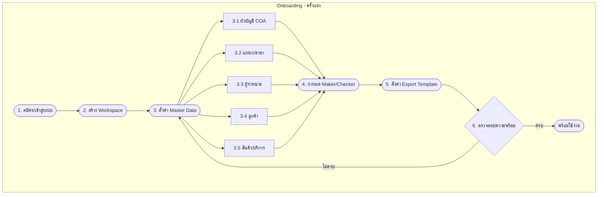


### Description


| Sub-step | Action                                            | Output                    |
| -------- | ------------------------------------------------- | ------------------------- |
| 1        | Admin สมัคร/เข้าสู่ระบบ                           | User account, JWT         |
| 2        | สร้าง Workspace (Tenant)                          | tenant_id, name, tax_id   |
| 3.1      | นำเข้า COA (Excel/CSV หรือ manual)                | chart_of_accounts records |
| 3.2      | เพิ่มแผนก/สาขา (Cost Center)                      | departments records       |
| 3.3–3.5  | นำเข้า Vendors, Customers, Products (optional)    | master data               |
| 4        | มอบหมาย User → Tenant ด้วย role maker/checker     | tenant_assignments        |
| 5        | ตั้งค่า Export Template (journal types, keywords) | express_templates         |
| 6        | ระบบเช็ค: COA + แผนกอย่างน้อย 1 รายการ            | Pass/Fail                 |


---

## Step 0.1: Staff Assignment

### Flowchart

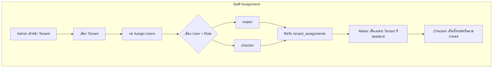


### Description

- **Purpose:** กำหนดว่า Maker/Checker คนไหนรับผิดชอบ Tenant ใด
- **Data:** `tenant_assignments(tenant_id, user_id, role)`
- **Effect:** Maker เห็นเฉพาะ Client ที่มอบหมาย; Checker อนุมัติได้ทุก Client (หรือตาม policy)

---

## Step 0.2: เลือกบริษัทลูกค้า (Workspace)

### Flowchart

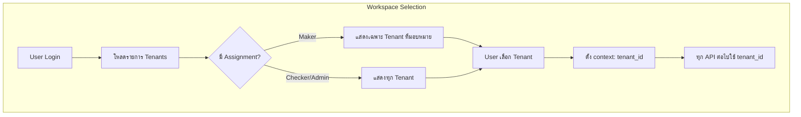


### Description

- **Purpose:** ตั้งบริบทการทำงานให้ชัดเจน
- **Output:** `tenant_id` ใน session/context สำหรับ API ต่อไป

---

## Step 1: Document Intake

### Flowchart

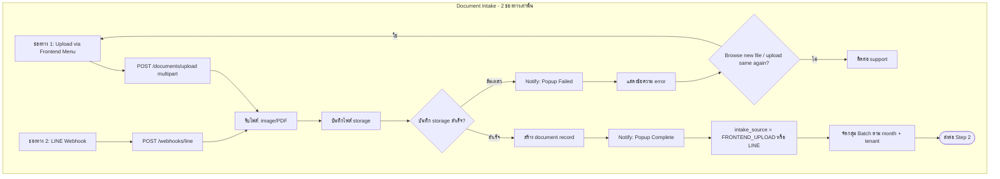


### Notify Process (แจ้งเตือนผู้ใช้)


| Result       | UI Feedback                                            | Description                                                                    |
| ------------ | ------------------------------------------------------ | ------------------------------------------------------------------------------ |
| **Complete** | Popup / Toast: "อัปโหลดสำเร็จ" หรือ "Upload complete"  | แสดงเมื่อบันทึกไฟล์และสร้าง document record สำเร็จ                             |
| **Failed**   | Popup / Toast: "อัปโหลดไม่สำเร็จ" หรือ "Upload failed" | แสดงเมื่อเกิด error (ไฟล์เสีย, storage ล้มเหลว, API error)                     |
| **Failed**   | แสดงข้อความ error เพิ่มเติม                            | เช่น "ไฟล์ขนาดเกินกำหนด", "รูปแบบไฟล์ไม่รองรับ", "เกิดข้อผิดพลาด กรุณาลองใหม่" |


**Implementation notes:**

- **Frontend Upload:** หลัง `POST /documents/upload` response → ถ้า 2xx แสดง popup success, ถ้า 4xx/5xx แสดง popup error พร้อม message
- **LINE:** Webhook response 200 = success; ถ้า fail อาจส่ง LINE reply กลับไปแจ้งผู้ใช้
- **Popup type:** Toast notification, Modal dialog, หรือ Inline message ตาม design system

### Description


| Channel         | API / Trigger                              | Data Stored                             |
| --------------- | ------------------------------------------ | --------------------------------------- |
| Frontend Upload | `POST /documents/upload`                   | file_url, intake_source=FRONTEND_UPLOAD |
| LINE            | `POST /webhooks/line` (LINE Messaging API) | file_url, intake_source=LINE            |


- **Batch:** จัดกลุ่มตาม `tenant_id` + `document_date` (month) เพื่อประมวลผลและอนุมัติเป็นชุด
- **Background:** รองรับการรันเป็น background process — รับไฟล์ทันที, ประมวลผลใน queue, แจ้ง popup เมื่อเสร็จ/ล้มเหลว

---

## Step 2: Pre-processing

### Flowchart

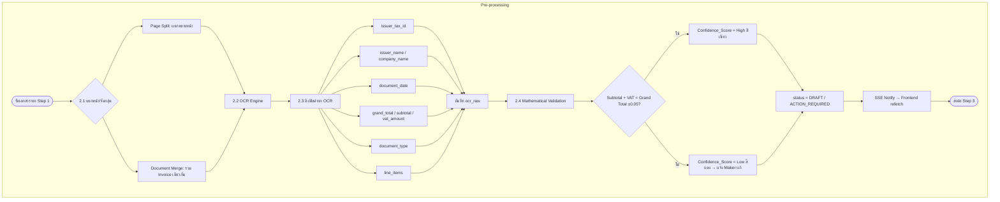


### Notify from Backend & Auto Reload

เมื่อ OCR/Pre-processing เสร็จ Backend แจ้ง Frontend → หน้าเว็บ reload อัตโนมัติเพื่อแสดงผลลัพธ์

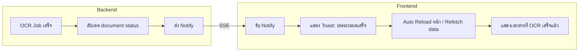


### Chosen Solution: SSE (Server-Sent Events)

ใช้ **SSE** สำหรับ Backend → Frontend notification เมื่อ OCR/Pre-processing เสร็จ


| Aspect        | Details                                                                                  |
| ------------- | ---------------------------------------------------------------------------------------- |
| **Backend**   | `GET /api/events/stream` — keep connection, ส่ง `{ documentId, status }` เมื่อ job เสร็จ |
| **Frontend**  | `EventSource('/api/events/stream')` — subscribe, `onmessage` → refetch + toast           |
| **Pros**      | ง่ายกว่า WebSocket, รองรับ auto reconnect, one-way (Backend → Frontend) เพียงพอ          |
| **Reconnect** | Browser reconnect อัตโนมัติเมื่อ connection หลุด                                         |


### Implementation (SSE)

**Backend — ตัวอย่าง Node.js/Express** (stack อื่นเทียบเท่าได้ เช่น Next.js App Router: `Route Handler` ที่ตั้ง `Content-Type: text/event-stream` และ stream `data: …\n\n` เหมือนกัน):

**Backend (Node.js/Express):**

```javascript
// GET /api/events/stream
app.get('/api/events/stream', (req, res) => {
  res.setHeader('Content-Type', 'text/event-stream');
  res.setHeader('Cache-Control', 'no-cache');
  res.setHeader('Connection', 'keep-alive');
  res.flushHeaders();

  const sendEvent = (data) => {
    res.write(`data: ${JSON.stringify(data)}\n\n`);
  };

  // เมื่อ OCR job เสร็จ (จาก job queue callback)
  jobQueue.on('documentProcessed', (doc) => {
    sendEvent({ event: 'document_processed', documentId: doc.id, status: doc.status });
  });

  req.on('close', () => { /* cleanup */ });
});
```

**Frontend (React/Next.js):**

```javascript
useEffect(() => {
  const es = new EventSource('/api/events/stream');
  es.onmessage = (e) => {
    const { event, documentId, status } = JSON.parse(e.data);
    if (event === 'document_processed') {
      toast.success('ประมวลผลเสร็จ');
      refetch(); // React Query / SWR
      // หรือ router.refresh() สำหรับ Next.js
    }
  };
  return () => es.close();
}, []);
```

**Auto Reload behavior:** ใช้ `refetch()` (React Query/SWR) หรือ `router.refresh()` (Next.js) แทน `window.location.reload()` เพื่อ UX ที่ดีกว่า

### Description


| Sub-step           | Logic                                                     | Output                                    |
| ------------------ | --------------------------------------------------------- | ----------------------------------------- |
| 2.1 Page Split     | เช็ค "หน้า 1/2", Invoice No. → แยก 1 หน้า = 1 transaction | array of pages                            |
| 2.1 Document Merge | Tax ID เดียว + เดือนเดียวกัน → รวมเป็น 1 transaction      | merged doc                                |
| 2.2 OCR            | Claude / Google Vision / Tesseract                        | ocr_raw JSON                              |
| 2.3 Extract        | Regex Tax ID `\d{13}`, วันที่, Amount หลัง "รวมสุทธิ"     | issuer_tax_id, document_date, grand_total |
| 2.4 Mathematical Validation | Subtotal + VAT = Grand Total (Tolerance ±0.05) | Confidence_Score: ถูก = High (สีเขียว), ผิด = Low (สีแดง แจ้ง Maker แก้ตัวเลข) |


- **Background:** OCR ใช้เวลานาน — รันใน job queue, อัปเดต status (OCR_PROCESSING → DRAFT), แจ้งผู้ใช้เมื่อเสร็จผ่าน **SSE**
- **Notify + Reload:** Backend แจ้งเมื่อ job เสร็จ → Frontend แสดง toast และ refetch/reload เพื่อแสดงผลลัพธ์

### OCR Output / Fields Extracted (Step 2)

ฟิลด์ที่ Step 2 สกัดจาก OCR — เก็บใน `ocr_raw` และใช้ใน Step 3, 4


| OCR Field                          | Extraction                                                   | Used in Step 3                          | Used in Step 4                      |
| ---------------------------------- | ------------------------------------------------------------ | --------------------------------------- | ----------------------------------- |
| **issuer_tax_id**                  | Regex `\d{13}` ใกล้ "เลขประจำตัวผู้เสียภาษี"                 | Direction (REVENUE/EXPENSE), ข้อมูลครบ? | VAT Logic, Vendor lookup            |
| **issuer_name** / **company_name** | ใกล้ "ชื่อ", "ผู้ขาย", "ผู้ซื้อ"                             | ข้อมูลครบ? (ไม่มี → QUERY)              | Vendor lookup                       |
| **document_date**                  | Regex วันที่ ใกล้ "วันที่", "Date"                           | ข้อมูลครบ?                              | —                                   |
| **grand_total**                    | ตัวเลขหลัง "รวมสุทธิ", "Grand Total"                         | ข้อมูลครบ?                              | —                                   |
| **subtotal**                       | ตัวเลขหลัง "รวมก่อนภาษี", "Subtotal"                         | —                                       | WHT (ยอด ≥ 1000)                    |
| **vat_amount**                     | ตัวเลขหลัง "ภาษี", "VAT" หรือคำนวณจาก grand_total − subtotal | —                                       | Dr. ภาษีซื้อ                        |
| **document_type** / **document**   | คำในเอกสาร: "ใบกำกับภาษี", "ใบเสร็จ", "ใบแจ้งหนี้", "PO"     | doc_type, journal_type                  | VAT Logic (มีใบกำกับภาษี?)          |
| **line_items**                     | Array: description, amount ต่อรายการ                         | Keyword classification                  | WHT keywords, Product keyword match |


**Storage:** เก็บใน `document.ocr_raw` (JSON) — Extraction Detail UI แสดงและแก้ไขได้

---

## Step 3: Classification

### Flowchart

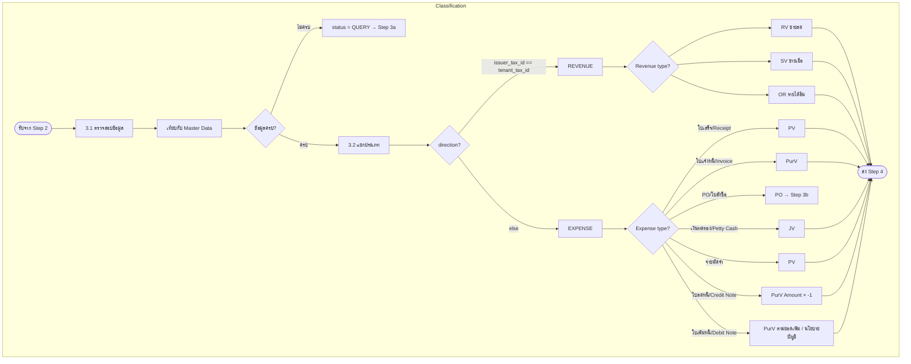


### Description


| Decision  | Condition                      | Result                     |
| --------- | ------------------------------ | -------------------------- |
| Direction | issuer_tax_id == tenant_tax_id | REVENUE                    |
| Direction | else                           | EXPENSE                    |
| Revenue   | รับเงินแล้ว                    | RV                         |
| Revenue   | ขายเชื่อ                       | SV                         |
| Revenue   | อื่นๆ                          | OR                         |
| Expense   | ใบเสร็จ/Receipt/บิลเงินสด      | PV                         |
| Expense   | ใบแจ้งหนี้/Invoice             | PurV                       |
| Expense   | PO/ใบสั่งซื้อ                  | PO (เก็บอ้างอิง, ไม่ลง GL) |
| Expense   | เงินทดรอง/Petty Cash           | JV                         |
| Expense   | จ่ายมัดจำ                      | PV                         |
| Expense   | ใบลดหนี้/Credit Note           | PurV (Amount × -1)          |
| Expense   | ใบเพิ่มหนี้/Debit Note          | PurV (Amount เพิ่ม / บันทึกตามนโยบายบัญชี) |


### OCR Info Used in Step 3


| OCR Field (from Step 2)            | Use in Step 3                                                                                                                                |
| ---------------------------------- | -------------------------------------------------------------------------------------------------------------------------------------------- |
| **issuer_tax_id**                  | เปรียบเทียบกับ tenant_tax_id → Direction (REVENUE/EXPENSE); ตรวจสอบ 13 หลัก → ข้อมูลครบ?                                                     |
| **tenant_tax_id**                  | จาก Master Data (Client) — ใช้เปรียบเทียบกับ issuer_tax_id                                                                                   |
| **document_date**                  | ตรวจสอบว่ามีค่า → ข้อมูลครบ?                                                                                                                 |
| **grand_total** / **subtotal**     | ตรวจสอบว่ามีค่า → ข้อมูลครบ?                                                                                                                 |
| **issuer_name** / **company_name** | ตรวจสอบว่ามีชื่อผู้ซื้อ/ผู้ขาย → ข้อมูลครบ? (ไม่มี → QUERY)                                                                                  |
| **document_type** / **document**   | คำว่า "ใบเสร็จ", "Receipt", "ใบแจ้งหนี้", "Invoice", "PO", "ใบสั่งซื้อ", "เงินทดรอง", "Petty Cash", "จ่ายมัดจำ", "ใบลดหนี้", "Credit Note", "ใบเพิ่มหนี้", "Debit Note" → แยก doc_type, journal_type |
| **line_items** (description)       | Keyword match สำหรับ classification (ใบเสร็จรับเงิน, ใบแจ้งหนี้ ฯลฯ)                                                                         |


- **Background:** Classification + Validation รันต่อจาก OCR — background job, อัปเดต direction, journal_type, doc_type
- **Petty Cash clearing (เคลียร์เงินทดรอง):** ชุดเอกสารมี "ใบเบิกเงินทดรอง", "ใบเบิกชดเชยเงินสดย่อย" + แนบบิลหลายใบ → ส่ง JV หรือ PV, Multiple Line Items: Dr. ค่าใช้จ่าย 1, Dr. ค่าใช้จ่าย 2, Dr. ภาษีซื้อ | Cr. เงินทดรองจ่าย/เงินสดย่อย
- **Duplicate Detection (บังคับใช้งาน production):** เมื่อพบบิลซ้ำตามกฎที่ตั้งค่า (เช่น Vendor + Amount + Date ±N วัน) — บล็อกหรือแจ้งเตือนให้ Maker ยืนยันก่อนดำเนินการต่อ; แสดง badge / toast / flag บนเอกสาร — **ความไว** ควรตั้งค่าได้ต่อ tenant

---

## Step 3a: Query Tray

### Flowchart

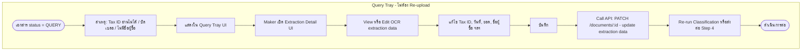


### Description

- **Trigger:** ข้อมูลไม่ครบจาก Step 3.1 (Tax ID, วันที่, ยอด, ชื่อผู้ซื้อ)
- **Action:** ไม่ต้อง re-upload — Maker เปิด **Extraction Detail UI** (หน้าเดียวกับ Step 2) เพื่อ view หรือ edit รายละเอียด OCR โดยตรง
- **Extraction Detail UI:** แสดงและแก้ไขได้ — Tax ID, วันที่, ยอด, ชื่อบริษัท, line items, ฯลฯ
- **หลังแก้ไข:** บันทึก → Frontend เรียก `PATCH /documents/:id` เพื่อ persist ข้อมูลที่แก้ไขไปยัง Backend (อัปเดต ocr_raw และฟิลด์ที่เกี่ยวข้อง) → Re-run Classification (Step 3) หรือส่งต่อ Step 4 ตามข้อมูลที่แก้ไข

---

## Step 3b: PO Matching

### Flowchart

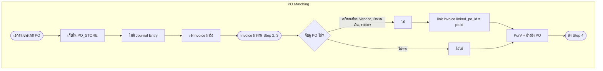


### Description

- **PO:** เก็บเป็นอ้างอิง ไม่ลง GL
- **Match:** เมื่อมี Invoice → เปรียบเทียบ Vendor, จำนวนเงิน, รายการ
- **Result:** ถ้าจับคู่ได้ → ตั้ง `linked_po_id`; ถ้าไม่ได้ → ลง PurV ตามปกติ

---

## Step 4: Tax & GL Mapping

### Flowchart

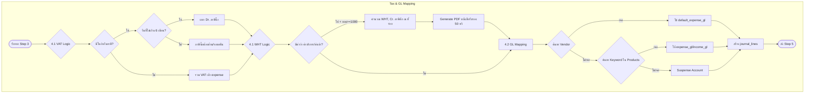


### Description


| Sub-step | Logic                                       | Output                            |
| -------- | ------------------------------------------- | --------------------------------- |
| 4.1 VAT  | ใบกำกับภาษี + Tax ID ครบ + **วันที่ไม่เกิน 6 เดือน** → แยก Dr. ภาษีซื้อ | vat_amount, journal line          |
| 4.1 VAT  | วันที่เกิน 6 เดือน → ภาษีซื้อต้องห้าม/รอขอคืน (ไม่แยก Dr. ภาษีซื้อ) | —                                 |
| 4.1 VAT  | บิลเงินสด → รวม VAT ใน expense              | ไม่มี Dr. ภาษีซื้อ                |
| 4.1 WHT  | ประเภทรายการที่เข้าข่ายหัก ณ ที่จ่าย (ดูคีย์เวิร์ดใน `line_items` เช่น ค่าบริการ, ค่าเช่า, ค่าขนส่ง, ค่าโฆษณา ฯลฯ) + เกณฑ์ยอด (เช่น ≥ 1,000 บ.) → **อัตราตามตารางกฎหมาย/ประเภทรายได้** (ไม่จำกัดแค่ 3%/5%) + **Generate PDF หนังสือรับรอง 50 ทวิ** | wht_amount, Cr. ภาษีหัก ณ ที่จ่าย, ไฟล์ 50 ทวิ |
| 4.2 GL   | Vendor match → default_expense_gl           | accountCode                       |
| 4.2 GL   | Product keyword match → expense_gl          | accountCode                       |
| 4.2 GL   | ไม่เจอ → Suspense                           | accountCode = suspense            |

- **VAT 6-month rule:** วันที่เอกสารไม่เกิน 6 เดือนนับจากเดือนปัจจุบัน — ถ้าเกินถือเป็นภาษีซื้อต้องห้าม/รอขอคืน
- **50 ทวิ PDF:** เมื่อมี WHT → สร้างไฟล์ PDF "หนังสือรับรองการหัก ณ ที่จ่าย" อัตโนมัติ เพื่อส่งให้ Vendor
- **AI Cross-Learning (optional):** แม้ Vendor แยกตาม Tenant — AI สามารถ Suggest GL ข้ามบริษัทได้ (เช่น 80% Map "การไฟฟ้า" → "ค่าไฟฟ้า" → Suggest ให้ลูกค้าใหม่)

### OCR Info Used in Step 4


| OCR Field (from Step 2)            | Use in Step 4                                                       |
| ---------------------------------- | ------------------------------------------------------------------- |
| **document_type** / **document**   | มีคำว่า "ใบกำกับภาษี" หรือไม่ → VAT Logic (แยกหรือรวม)              |
| **issuer_tax_id**                  | 13 หลัก ครบหรือไม่ → VAT (ต้องมีถึงจะแยก Dr. ภาษีซื้อได้)           |
| **vat_amount**                     | ยอดภาษีจาก OCR → สร้าง journal line Dr. ภาษีซื้อ                    |
| **subtotal** / **grand_total**     | ยอดก่อน VAT → ใช้คำนวณ WHT (ถ้า subtotal ≥ 1000)                    |
| **line_items** (description)       | Keyword: "ค่าบริการ", "ค่าเช่า", "ค่าขนส่ง", "ค่าโฆษณา" → WHT Logic |
| **issuer_tax_id**                  | ค้นหา Vendors.tax_id → Vendor match → default_expense_gl            |
| **issuer_name** / **company_name** | ใช้ร่วมกับ tax_id สำหรับ Vendor lookup                              |
| **line_items** (description)       | Keyword match กับ Products.keywords → expense_gl / income_gl        |


- **Background:** Classification (Step 3) และ Tax & GL Mapping (Step 4) มักรันต่อกันใน background หลัง OCR เสร็จ

---

## Step 5: Journal

### Flowchart

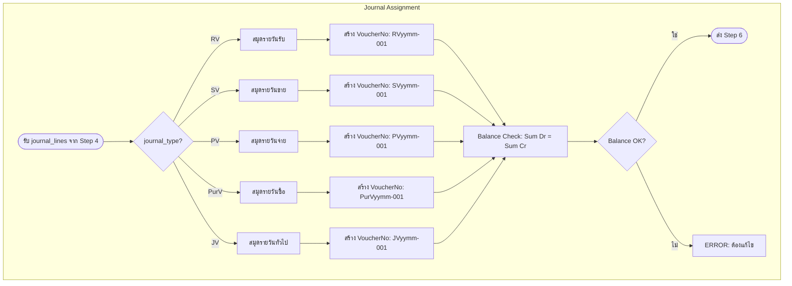


### Description

- **VoucherNo format:** `{JournalType}{YY}{MM}-{seq}` เช่น PV6701-001
- **Balance rule:** Sum(debit) = Sum(credit) ก่อนส่งต่อ
- **Journal types:** RV, SV, PV, PurV, JV

---

## Step 6: Maker/Checker

### Flowchart

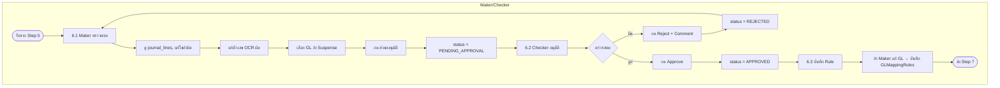


### Description


| Role          | Action                    | Next                                 |
| ------------- | ------------------------- | ------------------------------------ |
| Maker         | ตรวจ แก้ไข ส่งขออนุมัติ   | PENDING_APPROVAL                     |
| Checker       | Reject + Comment          | กลับให้ Maker                        |
| Checker       | Approve                   | APPROVED → บันทึก Rule               |
| Rule Learning | Maker แก้ GL จาก Suspense | บันทึก keyword → GL สำหรับครั้งถัดไป |


---

## Step 7: Export

### Flowchart

```mermaid
flowchart TD
    subgraph E7 [Export - Overall]
        E7_1([รับ APPROVED docs]) --> E7_2{7.1 ประมวลผลตามรอบ}
        E7_2 --> E7_2a[Daily]
        E7_2 --> E7_2b[Monthly]
        E7_2 --> E7_2c[Yearly]
        E7_2b --> E7_3[7.2 Filter: tenant, period, journal]
        E7_2a --> E7_3
        E7_2c --> E7_3
        E7_3 --> E7_4[7.3.1 Select Export Template]
        E7_4 --> E7_5[7.3.2 Document Selection]
        E7_5 --> E7_5a[Strong / Suitable / Other Matches]
        E7_5a --> E7_5b[เลือกเอกสาร → Preview Excel / Express TXT]
        E7_5b --> E7_6[7.3.3 Preview Modal]
        E7_6 --> E7_6a[Export Mode: Document Level vs Item Level]
        E7_6a --> E7_6b[Preview table + Records, Date Range, Total]
        E7_6b --> E7_7[7.3.4 Download / Save to Location]
        E7_7 --> E7_8[สร้างไฟล์ Excel หรือ Express .txt]
        E7_8 --> E7_9[Format H| D| ตาม Express]
        E7_9 --> E7_10[Balance check ก่อน export]
        E7_10 --> E7_11[status = EXPORTED]
        E7_11 --> E7_12[immutable post-export: ห้ามแก้รายการที่ส่งออกแล้ว — แก้ผ่าน Step 7b]
        E7_12 --> E7_13([ไฟล์พร้อมดาวน์โหลด])
    end
```


### Description

- **หลัง Export (สถานะ EXPORTED):** เอกสารที่รวมในไฟล์ Express แล้วถือเป็น **ถูกส่งมอบต่อระบบบัญชี** — ไม่แก้ยอด/สมุดบนเอกสารเดิม; การแก้ทำผ่าน **Step 7b (Reversal JV + รายการใหม่)** — คนละเรื่องกับ **Step 7a Period Lock** ที่ล็อกทั้งงวดตาม `document_date` (ทั้งคู่ใช้ร่วมกันได้: งวดล็อก + เอกสารที่ export แล้วไม่แก้ย้อนหลัง)
- **7.1 รอบเวลา:** Daily (bank recon), Monthly (export, ภาษี, Tax Report, Prepayments, Lock Period), Yearly (Depreciation, ปิดงบ)
- **7.2 รายเดือน:** Filter ตาม tenant_id, year_month, journal_type
- **7.3 Format:** Header `H|`, Detail `D|` ตามโครงสร้าง Express
- **Tax Report:** จาก Export — สร้างรายงาน ภ.พ.30 (ภาษีซื้อ-ขาย), ภ.ง.ด. 3/53 (ภาษีหัก ณ ที่จ่าย)
- **Monthly: Prepayments** — ตัดจำหน่ายค่าใช้จ่ายจ่ายล่วงหน้า (Prepayments)
- **Yearly: Depreciation** — คำนวณค่าเสื่อมราคาสินทรัพย์ (Depreciation), ล้างบัญชีรายได้-ค่าใช้จ่ายเข้ากำไรสะสม
- **Background:** Export ข้อมูลจำนวนมาก — สร้างไฟล์ใน background, แจ้งเมื่อพร้อมดาวน์โหลด (หรือส่งลิงก์อีเมล)

### 7.3 Export Engine (UI Reference)

Flow ตาม UI อ้างอิง — เลือก Template → เลือกเอกสาร → Preview → Download

```mermaid
flowchart TD
    subgraph E73 [7.3 Export Engine UI Flow]
        E73_1[7.3.1 Select Export Template]
        E73_1 --> E73_1a[รายการธุรกรรม: ขายเชื่อ, ขายสด, รายได้อื่นๆ]
        E73_1 --> E73_1b[ค่าใช้จ่าย: ใบสั่งซื้อ, ค่าใช้จ่ายอื่นๆ, จ่ายมัดจำ, ซื้อเชื่อ, ซื้อสด]
        E73_1 --> E73_1c[ข้อมูลหลัก: ผู้จำหน่าย, ลูกค้า, สินค้า - เร็วๆ นี้]
        E73_1 --> E73_1d[สมุดรายวัน: จ่าย, รับ - เร็วๆ นี้]
        E73_1a --> E73_2[7.3.2 Document Selection]
        E73_1b --> E73_2
        E73_2 --> E73_2a[Back to Templates]
        E73_2 --> E73_2b[Template name + X documents matched]
        E73_2 --> E73_2c[Strong Matches / Suitable Matches / Other Documents]
        E73_2c --> E73_2d[Select all matched, Group by Match Strength]
        E73_2d --> E73_2e[Table: Date, Document Name, Counterparty, Amount, Category]
        E73_2e --> E73_2f[Preview Excel หรือ Preview Express TXT]
        E73_2f --> E73_3[7.3.3 Preview Modal]
        E73_3 --> E73_3a[Export Mode: Document Level vs Item Level]
        E73_3a --> E73_3b[Document Level: 1 doc = 1 row]
        E73_3a --> E73_3c[Item Level: 1 item = 1 row]
        E73_3b --> E73_3d[Records, Date Range, Total Amount]
        E73_3c --> E73_3d
        E73_3d --> E73_3e[Preview table: วันที่, เลขที่เอกสาร, ชื่อลูกค้า]
        E73_3e --> E73_3f[Ready to Download - formatted for Express]
        E73_3f --> E73_4[7.3.4 Download]
        E73_4 --> E73_4a[Excel: Download Excel File]
        E73_4 --> E73_4b[Express TXT: Save to Location]
    end
```

| Sub-step | UI Element | Description |
|----------|------------|-------------|
| **7.3.1 Select Template** | Grid "Select Export Template" | "Choose a template that matches your documents" — แยกตามหมวด: รายการธุรกรรม (ขายเชื่อ, ขายสด, รายได้อื่นๆ), ค่าใช้จ่าย (ใบสั่งซื้อ, ค่าใช้จ่ายอื่นๆ, จ่ายมัดจำ, ซื้อเชื่อ, ซื้อสด), ข้อมูลหลัก (เร็วๆ นี้), สมุดรายวัน (เร็วๆ นี้) — แต่ละ card แสดง "X strong", "Y suitable" หรือ "0 matches" |
| **7.3.2 Document Selection** | Table + filters | Back to Templates; Template name + "X documents matched"; Select all matched; Group by Match Strength; Show All Documents; แสดง Strong Matches / Suitable Matches / Other Documents; คอลัมน์: Select, Match, Date, Document Name, Counterparty, Amount, Category; ปุ่ม Cancel + Preview Excel |
| **7.3.3 Preview** | Modal "Excel Preview - [template]" | Export Mode: Document Level (1 doc = 1 row, total amount) หรือ Item Level (1 item = 1 row); แสดง Records, Date Range, Total Amount; Preview table; "The Excel file will be formatted for Express Accounting Software"; Back to Selection + Download Excel File |
| **7.3.4 Download** | Buttons | Excel: Download Excel File; Express TXT: Save to Location (ให้ผู้ใช้เลือกตำแหน่งบันทึกด้วย showSaveFilePicker) |

**UI Reference Images:** อ้างอิง `assets/...` (screenshots 07.1–07.3) — หากยังไม่ได้ commit ไฟล์รูปใน repo นี้ ให้ถือแถวตารางด้านล่างเป็น **สเปก UI** จนกว่าจะมี asset จริง

| Screen | UI Flow | Image Ref |
|--------|---------|-----------|
| **Select Export Template** | Grid: "Choose a template that matches your documents" — หมวด รายการธุรกรรม (ขายเชื่อ, ขายสด, รายได้อื่นๆ), ค่าใช้จ่าย (ใบสั่งซื้อ, ค่าใช้จ่ายอื่นๆ, จ่ายมัดจำ, ซื้อเชื่อ, ซื้อสด), ข้อมูลหลัก, สมุดรายวัน — แต่ละ card แสดง X strong / Y suitable | `assets/.../07.1_0-*.png` |
| **Document Selection** | Back to Templates; Template name + "X documents matched"; Strong Matches / Suitable Matches / Other Documents; Select all matched; Group by Match Strength; Table: Date, Document Name, Counterparty, Amount, Category; Cancel + Preview Excel | `assets/.../07.2_0-*.png`, `assets/.../07_0-*.png` |
| **Excel/Express Preview** | Modal: "Excel Preview - [template name]"; Export Mode: Document Level (1 doc = 1 row) vs Item Level (1 item = 1 row); Records, Date Range, Total Amount; Preview table; "Ready to Download" — formatted for Express; Back to Selection + Download Excel File / Save to Location | `assets/.../07.3_0-*.png` |

### Match Strength Logic (Strong / Suitable / Other)

เอกสารแต่ละรายการถูกเปรียบเทียบกับ **Express Template** ที่เลือก — แต่ละ template มี `direction`, `journalTypes`, `categoryKeywords`

| Condition | ความหมาย |
|-----------|----------|
| **directionMatch** | ทิศทางบัญชี (REVENUE/EXPENSE) ของเอกสารตรงกับ template |
| **journalMatch** | `journalType` ของเอกสาร (RV, SV, PV, PurV, JV) อยู่ใน `journalTypes` ของ template |
| **keywordMatch** | category หรือ document name ของเอกสารมีคำใน `categoryKeywords` ของ template |

| Match Strength | เงื่อนไข | ความหมาย |
|----------------|----------|----------|
| **Strong** | directionMatch **และ** journalMatch **และ** keywordMatch | ตรงทั้ง 3 อย่าง — ความมั่นใจสูง แนะนำให้ export ได้เลย |
| **Suitable** | directionMatch **และ** (journalMatch **หรือ** keywordMatch) | ตรง 2 อย่าง — ความมั่นใจปานกลาง ควรตรวจก่อน export |
| **Other (Manual)** | directionMatch เท่านั้น หรือไม่ตรง template | ต้องเลือก template / แก้ไขด้วยตนเอง |

**ตัวอย่าง:**

- **Strong:** Template ขายสด (RV, keywords: ขายอาหาร, receipt) + เอกสาร journalType=RV, category="ขายอาหาร" → ตรงทั้ง 3
- **Suitable:** Template ขายสด + เอกสาร journalType=RV, category="ขายเครื่องดื่ม" → ตรง direction + journal แต่ไม่ตรง keyword
- **Other:** เอกสาร journalType=JV หรือ category="รายจ่าย" ไม่ตรง template → Manual

**Data ที่ใช้:** `transactionDirection` / `cashflowType`, `journalType`, `expense_category` / `expense_type`, line items description

**UI:** Strong = badge สีเขียว, Suitable = badge สีเหลือง, Other = badge สีม่วง (Manual)

### Suggested: Multiple Export Template Selection (ตามฝ่ายบัญชี / Accounting Part)

รองรับหลาย Template ตาม **ฝ่ายบัญชี** หรือ **ประเภทบัญชี** — แต่ละฝ่ายอาจใช้รูปแบบ Express ต่างกัน


| Selection Basis                 | Use Case                    | Example                                                 |
| ------------------------------- | --------------------------- | ------------------------------------------------------- |
| **accounting_part** (ฝ่ายบัญชี) | แยกตามทีม/ฝ่ายที่ดูแลลูกค้า | ฝ่าย A: ลูกค้าประเภทขายปลีก, ฝ่าย B: ลูกค้าประเภทบริการ |
| **journal_type**                | แยกไฟล์ตามสมุดรายวัน        | PV+PurV ไฟล์หนึ่ง, JV อีกไฟล์                           |
| **client_type**                 | แยกตามประเภทนิติบุคคล       | บริษัทจำกัด, ห้างหุ้นส่วน, ร้านค้าเดี่ยว                |
| **express_version**             | รูปแบบ TXT ต่างเวอร์ชัน     | Express เก่า vs ใหม่                                    |


**Flow:**

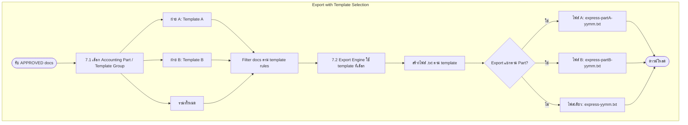


**Data model suggestion:**


| Table / Field                       | Purpose                                              |
| ----------------------------------- | ---------------------------------------------------- |
| `express_templates.accounting_part` | ฝ่ายบัญชี เช่น "A", "B", "ทั่วไป"                    |
| `express_templates.template_group`  | กลุ่ม template สำหรับเลือกตอน export                 |
| `tenants.default_export_template`   | Template เริ่มต้นของ tenant                          |
| `export_template_selections`        | บันทึกว่า user เลือก template ใดเมื่อ export (audit) |


**UI:** หน้า Export — dropdown "ฝ่ายบัญชี / Template" ก่อนกด Export; หรือ checkbox "Export แยกตามฝ่าย" → ได้หลายไฟล์

---

## Step 7a: Period Lock

### Flowchart

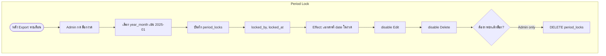


### Description

- **Table:** `period_locks(tenant_id, year_month, locked_by, locked_at)`
- **Effect:** เอกสารที่ `document_date` อยู่ในงวดที่ล็อก → ห้าม Edit/Delete

---

## Step 7b: Correction/Reversal

### Flowchart

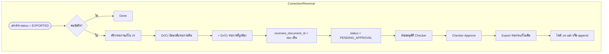


### Description

- **Method:** Reversal JV (Dr↔Cr ย้อนรายการเดิม) + รายการที่ถูกต้อง
- **Link:** `reverses_document_id` ชี้ไปที่ document เดิม
- **Export:** Export เป็นไฟล์เพิ่ม → นำเข้า Express แยก

---

## Step 7c: Bank Reconciliation

### Flowchart

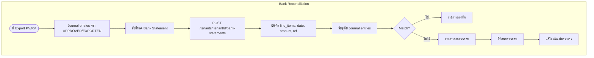


### Description

- **API:** อัปโหลด/สร้าง bank statement ภายใต้บริบท tenant — `POST /tenants/:tenantId/bank-statements` (หรือเทียบเท่า) เพื่อให้สอดคล้องกับ route อื่นที่มี `tenant_id`
- **Input:** Bank statement (upload หรือ API ธนาคาร)
- **Match:** เปรียบเทียบ date, amount, reference ระหว่าง bank กับ journal
- **Output:** รายการที่ตรงกัน / รายการรอตรวจสอบ

---

## Summary: Step Order Reference


| Step | Title               | Key Output                        |
| ---- | ------------------- | --------------------------------- |
| 0    | Onboarding          | tenant, master data, assignments  |
| 0.1  | Staff Assignment    | tenant_assignments                |
| 0.2  | เลือก Workspace     | tenant_id context                 |
| 1    | Document Intake     | document + intake_source          |
| 2    | Pre-processing      | ocr_raw, extracted fields         |
| 3    | Classification      | direction, journal_type, doc_type |
| 3a   | Query Tray          | notify → resubmit                 |
| 3b   | PO Matching         | linked_po_id                      |
| 4    | Tax & GL Mapping    | journal_lines, vat, wht           |
| 5    | Journal             | voucher_no, balanced entries      |
| 6    | Maker/Checker       | APPROVED, rule learning           |
| 7    | Export              | Express .txt, EXPORTED            |
| 7a   | Period Lock         | period_locks                      |
| 7b   | Correction/Reversal | reversal JV                       |
| 7c   | Bank Reconciliation | matched/unmatched                 |


